# Devlog
### Superpoint paper!! (Feb 13, 2023)
Looked at Superpoint paper (https://arxiv.org/pdf/1712.07629v4.pdf) to see if it is suited for
board detection.  
Key take away:
- Upscale output to (1, H, W) from features.
  - This would be key points in white pixels
- Self-Supervise by using 3d generated chess models and keypoints (use Blender)
  - This can be used to create large dataset for **Piece Detector** too

### Massive Changes (Feb 12, 2023)
#### Why a Change of plans
The initial solution was to predict four corners of the board using
simple conv architecture such as Densenet or resnet, warp it and 
then send it into object detection to detect pieces. By warping the image
by the corners of the board, I can estimate location of all squares simply by
using a grid system.

Best case warp scenario: 
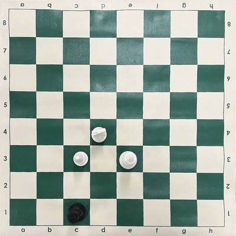

Worst case warp scenario: 
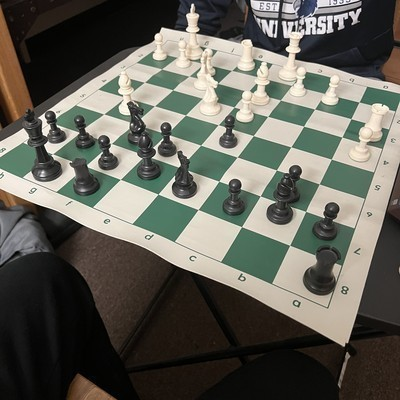 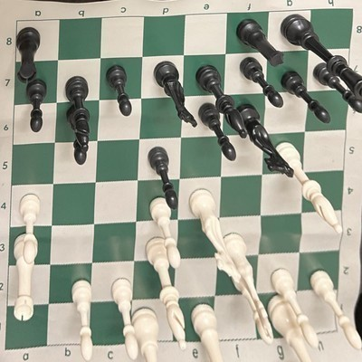

The problems with this solution, after the warp:
- the images were lower in resolution.
- the images were too cropped cutting some pieces.
- pieces were also skewed too much, depending on image angle.
This made it very difficult for **piece detector** to detect pieces.

#### New Solution
The job of the **board detector** should be to detect every square. I tried using hough transform from
the cv2 library to detect the squares on the board, but unfortunately the detections are not very accurate.
The detections tend to go outside the board and even on pieces and players' clothing when resolution is high.

Hough transform on low res (300px): 

Hough transform on high res (800px): 

Then the **piece detector** would work on the same image to detect bbox for each piece.
putting them together, we can get accurate detections without compromising piece detector. 
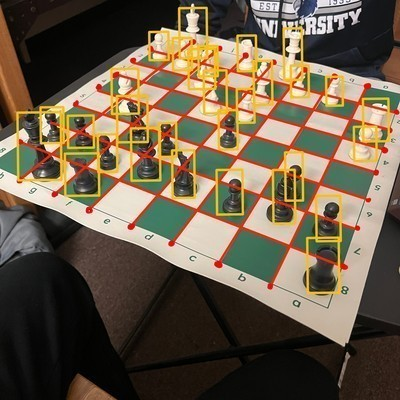

One small problem with this solution could be that, sometimes piece bboxs can be over 
two squares. This can potentially be solved by looking at only bottom half of bbox because
the bottom of the piece will always be in the right square.
  

#### Roboflow to VIA
It was tedious and slow to upload images to roboflow to annotate. The solution
was to find a local annotation software to keep all images in one place. Looked at
label studio, but found VIA (VGG image annotator). Which was easy to use and did not
need any pip installations.
  

#### device("mps") ??
Learned about MPS in pytorch to speed up training on Apple Silicon. Also found
an issue with torch.topk only works for k<=16 when device="mps" and 
torch.topk is used by fasterrcnn for NMS (non-max-suppression). The issue is 
currently being worked on by pytorch contributors. So there is not much I can 
do other than, wait.

### Overfitting Board Detector Issue (Feb 2, 2023)
Focused on overfitting board_detector data. After [0.3.1] (changes to
board detector dataset), there was a major issue that was found. Overfitting only
happened to particularly same few images while rest of the images were completely off.

After a ton of debugging, from ensuring the data is being shuffled, to
checking individual images and figuring out exact overfitting images. The problem
was simply with incorrect length function (__len__) in board dataset module.

### Dealing with GitHub and large files (Jan 1, 2023)
The saved files from training piece detector were too big, therefore
had issues with GitHub accepting such large files. Used force push to push changes 
since local git and GitHub did not have same branch. Had to figure out some 
trickery to finally sync local git and GitHub.

### Massive fix to the piece detector model (May 11, 2023)
I realized that FasterRCNN does not normalize the bbox predictions. Where as, my dataset 
had normalized the target bbox for the FasterRCNN. This has caused the FasterRCNN model
to take an extremely large iterations to see noticeable gains. Therefore, after **fixing the
dataset by removing the normalization for bboxes**, the model performed a lot better with very
few iterations. 

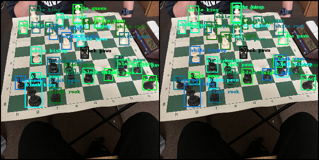 

_left: target bboxes, right: prediction bboxes_  
The was successfully able to over-fit to a small batch size. which indicates the model 
is going to work for a larger dataset.

#### New implementation: Tensorboard
Along with the major fix, I have implemented tensorboard to visualize and track the losses to better
evaluate the model. I have **begun hyperparameter search and found that batch size of 2 and learning rate of
1e-4 worked best for this small dataset**. I plan to continue to further search for better hyperparameters.
 
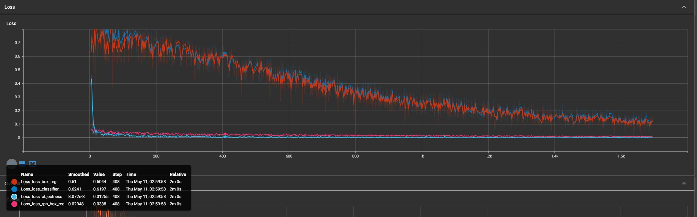 
_loss_rpn_box_reg (dark red): loss of the predicted box vs ground truth box_ 
_loss_box_red (pink): loss of predicted location of bbox vs ground truth box location_ 
_loss_objectiveness (light blue): loss of if there is an object in bbox_ 
_loss_classifier (blue): classification loss of piece in bbox_  

### Synthetic Data Generation (May 19, 2023)

#### Plan
The motivation behind synthetic data generation is to avoid 
the tedious task of collecting and labeling chess images by hand, 
which can take weeks to collect and label just 100 images. My plan was
to generate synthetic data using Blender, since it allows for python scripting.

#### Action
Although the idea was simple, the implementation was difficult. Fortunately, I
had a fair bit of experience using Blender which made it a little easier.

###### Step 1. Create a realistic scene
I had to search and download 3D piece models, I had to learn about creating textures, using nodes, 
principled BSDF, different lighting and UV unwrapping.

###### Step 2. Write code to create random scenes
This involved writing python code to place camera in different positions while
still looking at the board. Setting up random positions on the board
using fen as input. There are still a lot more randomness that could take place
such as different piece types, board color, table material, lighting change, and
various environment props.

###### Step 3. Write code to create annotations
This was difficult to come up with entirely from my own code, so I have used
help from the community. Below are the links:

https://github.com/georg-wolflein/chesscog/blob/master/scripts/synthesize_data.py#L195  
https://blender.stackexchange.com/a/158236  
https://stackoverflow.com/questions/63753960  

#### output example:
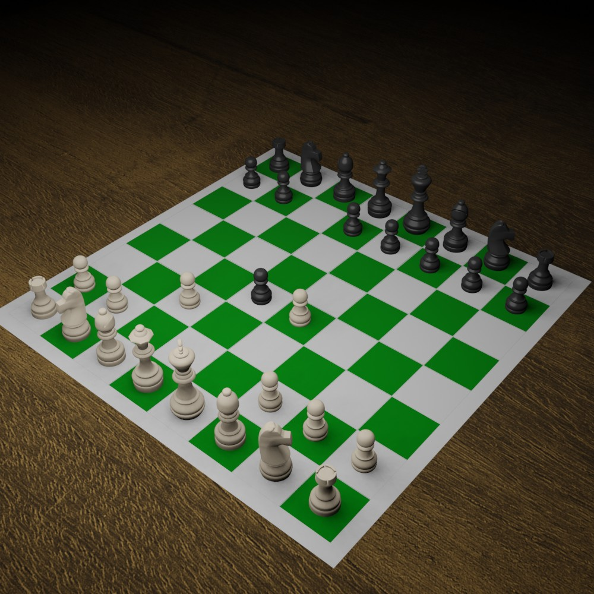

#### output example with annotations:
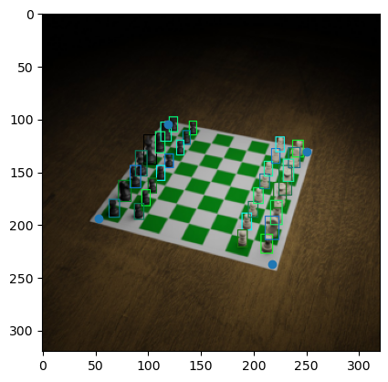

Clearly, the annotations are far more accurate than humans, and
the variation of the image can be limitless. It really comes down
to how realistic I can render the scene.

### Training on Large Dataset for Long time (Dec 30, 2023)
using the blender automation script, I was able generate about 10k images in a few hours with detailed
labels. I had stored them in a hard drive outside of this project folder because I expect this to get
bigger in size. Currently the data is about 2GB which is not bad at all. The image size is 600 x 600 because
I do not expect the model should need more resolution than this. The thought process behind this resolution is that
if a human can detect the board from a low resolution image, then the model should be able to achive the same result.
Although the model was trained on even lower resolution of 320 x 320, which is still detectable by me. Enough chat here
are the results of the model with piece detection: 

I am testing from the <a href="https://paperswithcode.com/dataset/chessred">chessred</a> dataset images because my model has not seen them. And these images are without obstructions and have ample lighting which create an
optimal image for perfect detection. I wanted to see how my model would do if it
was given a easily detectable image first.
#### Few pieces
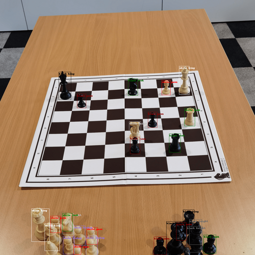
the mistake here is minial with just one incorrect classification of the black knight (miss took for black rook). Also notice that it detects pieces outside the board.

#### Many pieces
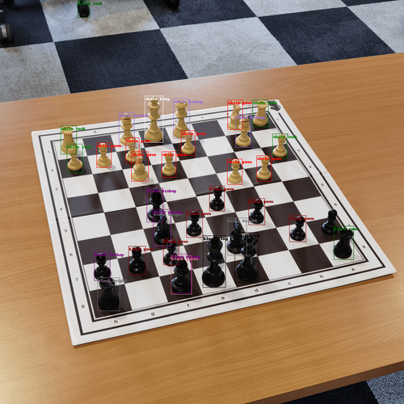
There are clearly a lot of mistakes. Funny to see that it detects the chair's wheel in the background as black rook.

### Better Synthetic Data Generation (Jan 9, 2024)
#### Why long time no see
As much as I wanted to spend time on this project, immense school work put a halt on this project. 
However, I am back with a much needed update to this project. I have been working on trying to collect
large amounts of data through the use of synthetic data generation.  

#### Making better sythetic data
The most important part is to create realistic scene as explained in prev dev log. So I saw some youtube
tutorials and created better floor textures, I created procedural textures using node editing in blender. 
I made carpet, wood, marble and leather. Further more, I added a new piece set model. 

#### Problem with data collection
The problem I have faced commonly was that the python script used to run the 
blender automation cannot be inturputed. This is because the current method works by saving
the annotaions to a json file which is extremely large (~30MB+ for board.json and piece.json for about 10k images). 
During the blender script the json file is loaded onto memory and all the annotations are added to a varible in python
this means when inturupted the annotations will not be saved.  

#### How I solved the problem
I wanted to have a way to checkpoint the large data collected to be protected from when the script stops running.
The solution I found was to use sqlite3 to save to a .db file. This means that I can inturupt the blender script
without having to lose the entire dataset in memory.  

#### Optimization
Although I found that querying to the database every image made the automation slow. After some thought, I was able to
solve this issue by creating a temp memory and a SAVE_TIMER variable, which make query to the database after x iterations
and everything in the temp memory will be dumped into the database.  

#### More optimization
Before I had two json files, one for board annotations and one for piece annotations, since this is a .db file it was easy
to simply create one database (annotations.db) with the following structure: 
* images
    * id
    * file_name
    * height
    * width

* piece_annotations
    * id
    * image_id
    * category_id
    * bbox

* piece_categories
    * id
    * supercategory
    * name

* board_annotations
    * id
    * image_id
    * category_id
    * keypoints
    
* board_categories
    * id
    * supercategory
    * name

This also means that at no time would there be a conflict of images between board and piece detection since they are in the same file.

### Purposefully Overfitting (Jan 9, 2024)
The reasoning behind overfitting is to ensure that the model is complex enough to capture the trend in the data. Therefore, I have puposefully overfit my model on 100 generated images. Here is the loss:

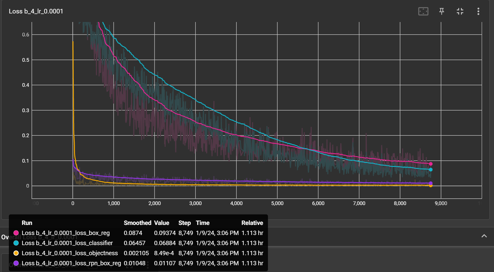

it took the model 8,749 steps to have a decent loss. The main issue was to reduce the loss_box_reg (pink) and loss_classifier (blue). These losses take up the entirety of the compute (rtx 3060). I plan to use AWS or other cloud gpu service to speed this up.
