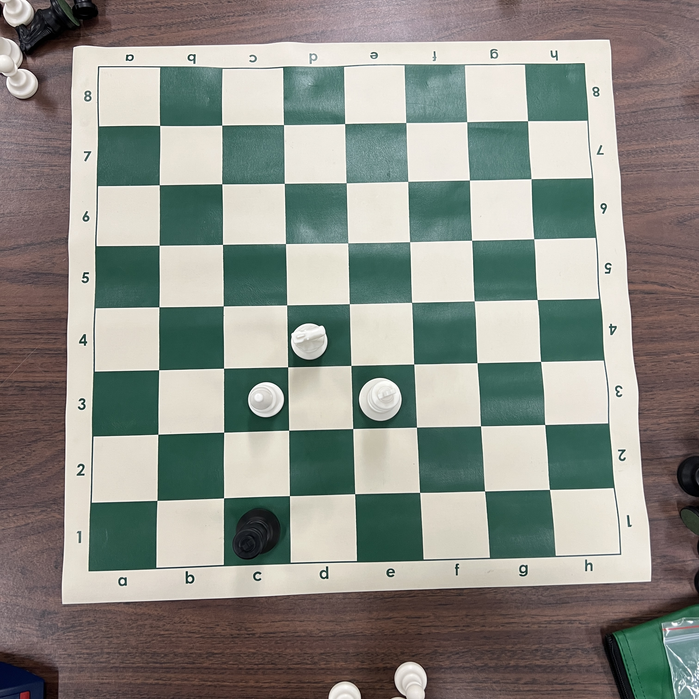
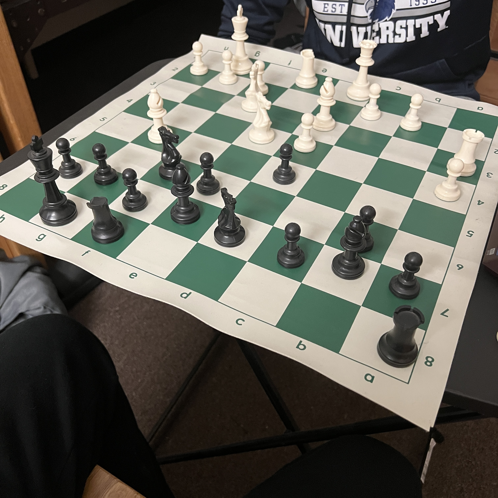
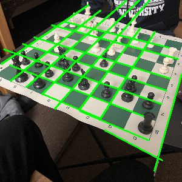
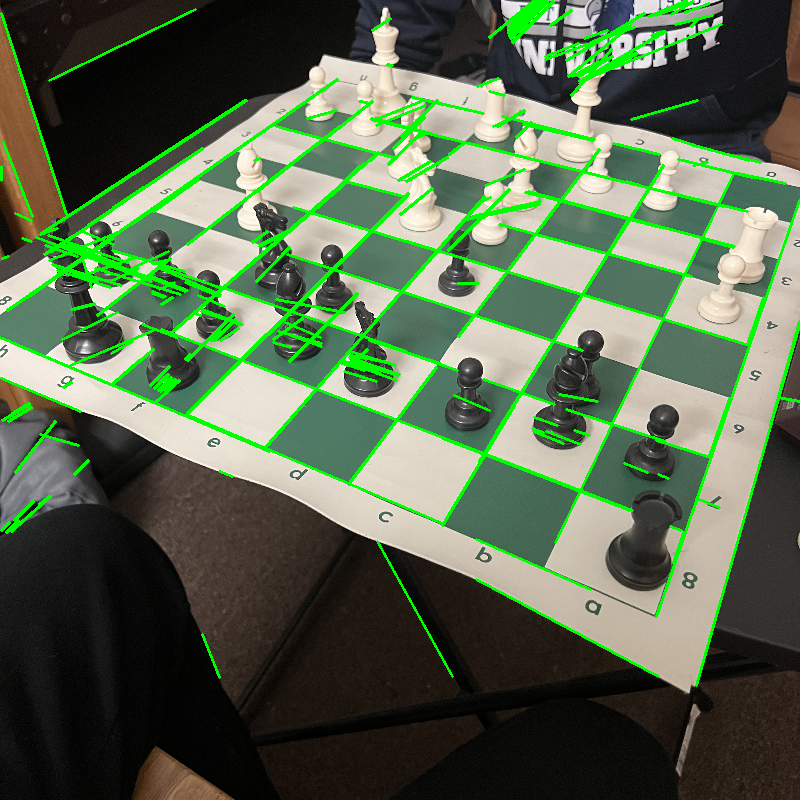

# Devlog

### Massive Changes (Feb 12, 2023)
#### Why a Change of plans
The initial solution was to predict four corners of the board using
simple conv architecture such as Densenet or resnet, warp it and 
then send it into object detection to detect pieces. By warping the image
by the corners of the board, I can estimate location of all squares simply by
using a grid system.

Best case warp scenario: 

Worst case warp scenario: 
 

The problems with this solution, after the warp:
- the images were lower in resolution.
- the images were too cropped cutting some pieces.
- pieces were also skewed too much, depending on image angle.
This made it very difficult for **piece detector** to detect pieces.

#### New Solution
The job of the **board detector** should be to detect every square. I tried using hough transform from
the cv2 library to detect the squares on the board, but unfortunately the detections are not very accurate.
The detections tend to go outside the board and even on pieces and players' clothing when resolution is high.

Hough transform on low res (300px): 

Hough transform on high res (800px): 

Then the **piece detector** would work on the same image to detect bbox for each piece.
putting them together, we can get accurate detections without compromising piece detector. 

One small problem with this solution could be that, sometimes piece bboxs can be over 
two squares. This can potentially be solved by looking at only bottom half of bbox because
the bottom of the piece will always be in the right square.
  

#### Roboflow to VIA
It was tedious and slow to upload images to roboflow to annotate. The solution
was to find a local annotation software to keep all images in one place. Looked at
label studio, but found VIA (VGG image annotator). Which was easy to use and did not
need any pip installations.
  

#### device("mps") ??
Learned about MPS in pytorch to speed up training on Apple Silicon. Also found
an issue with torch.topk only works for k<=16 when device="mps" and 
torch.topk is used by fasterrcnn for NMS (non-max-suppression). The issue is 
currently being worked on by pytorch contributors. So there is not much I can 
do other than, wait.

### Overfitting Board Detector Issue (Feb 2, 2023)
Focused on overfitting board_detector data. After [0.3.1] (changes to
board detector dataset), there was a major issue that was found. Overfitting only
happened to particularly same few images while rest of the images were completely off.

After a ton of debugging, from ensuring the data is being shuffled, to
checking individual images and figuring out exact overfitting images. The problem
was simply with incorrect length function (__len__) in board dataset module.

### Dealing with GitHub and large files (Jan 1, 2023)
The saved files from training piece detector were too big, therefore
had issues with GitHub accepting such large files. Used force push to push changes 
since local git and GitHub did not have same branch. Had to figure out some 
trickery to finally sync local git and GitHub.